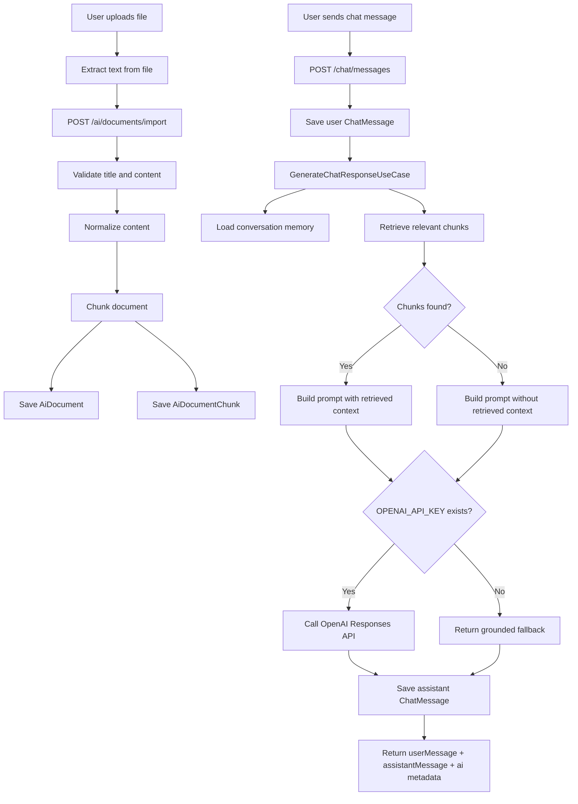

# AI Chat RAG Flow

Tài liệu này mô tả luồng xử lý toàn trình cho tính năng chat AI đọc, phân tích và đối chiếu văn bản nội bộ do user import lên.

Mục tiêu của flow là biến hệ thống chat hiện tại thành một RAG MVP: user đưa tài liệu nội bộ vào hệ thống, server chia nhỏ và lưu tài liệu, khi user hỏi thì AI retrieve các đoạn liên quan, build prompt có căn cứ, rồi sinh câu trả lời và lưu lại vào lịch sử chat.

## 1. Các Thành Phần Chính

### Chat Module

`server/src/chat` chịu trách nhiệm:

- Nhận message từ user qua `POST /chat/messages`.
- Lưu message của user vào `ChatMessage`.
- Gọi AI module để sinh câu trả lời.
- Lưu message của assistant vào `ChatMessage`.
- Trả về cả `userMessage`, `assistantMessage`, và metadata từ AI.

### AI Module

`server/src/ai` chịu trách nhiệm:

- Import tài liệu nội bộ.
- Normalize và chunk nội dung tài liệu.
- Lưu document và chunks vào database.
- Retrieve các chunk liên quan khi user hỏi.
- Build prompt gồm system policy, retrieved context, memory, conversation, và user question.
- Gọi model provider để sinh câu trả lời.
- Trả fallback có căn cứ nếu chưa cấu hình model provider.

### Database

Các bảng liên quan:

- `ChatMessage`: lưu lịch sử chat.
- `Memory`: lưu memory ngắn/dài hạn của conversation.
- `AiDocument`: lưu bản gốc của tài liệu user import.
- `AiDocumentChunk`: lưu các đoạn nhỏ đã chunk để retrieval.

## 2. Flow Khi User Import Một File

Hiện tại backend nhận import ở dạng text content qua endpoint:

```http
POST /ai/documents/import
```

Payload hiện tại:

```json
{
  "title": "Nghị định ABC",
  "source": "internal-upload/nghi-dinh-abc.pdf",
  "content": "Toàn bộ nội dung văn bản đã được extract thành text...",
  "userId": "user-id"
}
```

Lưu ý: endpoint hiện tại chưa trực tiếp nhận binary file như PDF/DOCX. Với upload file thật, frontend hoặc backend cần thêm một bước parser để extract text trước khi gọi flow import này.

### Bước 1: User Upload File

User chọn file như PDF, DOCX, TXT hoặc văn bản nội bộ.

Nếu là TXT hoặc content đã có sẵn text:

- Frontend gửi thẳng `title`, `source`, `content`, `userId` lên `/ai/documents/import`.

Nếu là PDF/DOCX/scan:

- Cần thêm file parser trước.
- Parser đọc file, extract text, metadata, page number nếu có.
- Sau đó gọi `/ai/documents/import` với text đã extract.

Trong tương lai, parser nên tách thành pipeline riêng:

- PDF text extraction.
- DOCX extraction.
- OCR cho scan.
- Table extraction.
- Page/section metadata.
- Background job nếu file lớn.

### Bước 2: Validate Input

`ImportDocumentUseCase` kiểm tra:

- `title` không rỗng.
- `content` không rỗng.

Nếu thiếu title hoặc content, server trả `BadRequestException`.

### Bước 3: Normalize Content

Server chuẩn hóa content:

- Chuyển `\r\n` về `\n`.
- Gộp khoảng trắng thừa.
- Giảm số dòng trống liên tiếp.
- Trim đầu/cuối.

Mục tiêu là làm sạch text trước khi chunk và search.

### Bước 4: Chunk Document

Server chia tài liệu thành các đoạn nhỏ.

Chiến lược hiện tại:

- Ưu tiên split theo paragraph.
- Mỗi chunk tối đa khoảng `1800` ký tự.
- Có overlap khoảng `220` ký tự cho đoạn quá dài.

Overlap giúp giảm nguy cơ mất ngữ cảnh khi một ý nằm giữa ranh giới hai chunk.

### Bước 5: Build Search Text

Với mỗi chunk, server tạo `searchText` bằng cách nối:

- Title.
- Source.
- Chunk content.

Sau đó lower-case để phục vụ keyword search.

### Bước 6: Save To Database

Server lưu:

- Một record `AiDocument` chứa tài liệu gốc.
- Nhiều record `AiDocumentChunk` chứa các chunk.

Quan hệ:

```text
AiDocument 1 - n AiDocumentChunk
```

Response trả về document đã tạo và `chunkCount`.

## 3. Flow Khi User Hỏi Chat Về Một Văn Bản Có Trong Database

Endpoint:

```http
POST /chat/messages
```

Payload ví dụ:

```json
{
  "conversationId": "conv-001",
  "senderId": "user-id",
  "senderName": "Nguyen Van A",
  "content": "Theo Nghị định ABC thì điều kiện gia hạn hồ sơ là gì?"
}
```

### Bước 1: Chat Validate Message

`CreateMessageUseCase` kiểm tra `content`.

Nếu message rỗng, server trả `BadRequestException`.

### Bước 2: Save User Message

Server tạo `ChatMessage` cho user:

```text
senderId = user-id
senderName = Nguyen Van A
content = câu hỏi của user
conversationId = conv-001
```

Message này được lưu trước khi gọi AI.

### Bước 3: Chat Calls AI Module

Chat gọi `GenerateChatResponseUseCase` bằng `AiChatRequest`:

```text
conversationId = conv-001
message = câu hỏi của user
userId = senderId
```

Từ đây quyền xử lý chuyển sang AI module.

### Bước 4: Load Conversation Memory

AI gọi `ConversationMemoryService`.

Hiện tại memory dùng bảng `Memory` để lấy các record liên quan tới:

- `conversationId`.
- `userId` nếu có.

Memory giúp AI nhớ các thông tin quan trọng trong conversation trước đó.

### Bước 5: Create Token Budget

AI tạo `TokenBudget`.

Budget xác định dung lượng dành cho:

- Prompt input.
- Output response.
- History.
- Memory.
- Retrieved documents.

Mục tiêu là tránh prompt vượt quá giới hạn model.

### Bước 6: Retrieve Relevant Document Chunks

`PromptContextBuilderService` gọi retrieval provider.

Retrieval hiện tại là `KeywordRetrievalRepository`.

Luồng retrieval:

1. Normalize query.
2. Tách query thành các keyword.
3. Bỏ một số stop words.
4. Query `AiDocumentChunk` theo `searchText contains keyword`.
5. Tính relevance score cho từng chunk.
6. Sort theo score giảm dần.
7. Lấy top chunks.

Nếu văn bản đã import có keyword phù hợp, server sẽ retrieve được các chunk liên quan.

### Bước 7: Build Prompt Context

AI build prompt gồm các section:

- System instruction: vai trò AI, ưu tiên chính xác, không bịa quy định.
- Policy instruction: phân biệt retrieved evidence và general knowledge.
- Retrieval context: các chunk liên quan đã tìm thấy.
- Memory context: memory của conversation nếu có.
- Conversation context: lịch sử chat nếu được truyền vào.
- Current user request: câu hỏi hiện tại.

Retrieval context là phần quan trọng nhất cho use case văn bản nội bộ.

### Bước 8: Model Provider Generates Answer

`OpenAiProvider` xử lý theo hai nhánh.

Nếu có `OPENAI_API_KEY`:

- Server gọi OpenAI Responses API.
- Model nhận prompt đã có retrieved context.
- Model trả câu trả lời tổng hợp dựa trên tài liệu.
- Response kèm usage và list retrieved document ids.

Nếu chưa có `OPENAI_API_KEY`:

- Server không gọi model bên ngoài.
- Server trả fallback grounded answer.
- Fallback liệt kê các đoạn nội bộ liên quan nhất.
- Mục tiêu là vẫn chứng minh retrieval flow đang hoạt động.

### Bước 9: Save Assistant Message

Chat nhận AI response và tạo thêm một `ChatMessage`:

```text
senderId = ai-assistant
senderName = AI Assistant
content = nội dung AI trả lời
conversationId = conv-001
```

Sau đó lưu assistant message vào DB.

### Bước 10: Return Response To Client

Response của `POST /chat/messages` gồm:

```json
{
  "code": 0,
  "message": "Send message and generate AI response successfully",
  "data": {
    "userMessage": {},
    "assistantMessage": {},
    "ai": {
      "content": "Câu trả lời của AI",
      "model": "gpt-4.1-mini hoặc local-grounded-fallback",
      "usage": {},
      "memoriesApplied": [],
      "retrievedDocuments": []
    }
  }
}
```

Frontend có thể render ngay `assistantMessage.content` trong chat thread.

## 4. Flow Khi User Hỏi Về Văn Bản Không Có Trong Database

Ví dụ user hỏi:

```text
Theo Nghị định XYZ chưa từng import, điều kiện xử lý là gì?
```

### Bước 1: Chat Vẫn Lưu User Message

Message vẫn được lưu vào `ChatMessage`.

Điều này giúp giữ nguyên lịch sử conversation, kể cả khi hệ thống không tìm thấy tài liệu.

### Bước 2: Retrieval Không Tìm Thấy Chunk Phù Hợp

`KeywordRetrievalRepository` sẽ:

- Tách keyword từ câu hỏi.
- Query bảng `AiDocumentChunk`.
- Không tìm được chunk có `searchText` match.
- Trả về mảng rỗng.

### Bước 3: Prompt Không Có Retrieval Context

`PromptContextBuilderService` vẫn build prompt, nhưng không thêm retrieval section.

AI lúc này chỉ có:

- System instruction.
- Policy instruction.
- Memory nếu có.
- User question.

### Bước 4: AI Không Được Bịa Căn Cứ Nội Bộ

Policy hiện tại yêu cầu:

- Ưu tiên nội dung retrieved.
- Nếu retrieved information không đủ, phải nói rõ uncertainty.
- Tránh tự bịa điều khoản, quy định, nghị định.

Nếu chưa có `OPENAI_API_KEY`, fallback sẽ trả:

```text
Mình chưa tìm thấy nội dung nội bộ đủ liên quan để trả lời chắc chắn...
```

Nếu có `OPENAI_API_KEY`, model vẫn có thể dùng general knowledge, nhưng prompt yêu cầu phải phân biệt general knowledge với retrieved evidence. Với use case pháp lý/nội bộ, nên yêu cầu model trả lời theo kiểu:

- Không tìm thấy tài liệu nội bộ liên quan.
- Không thể xác nhận theo database hiện tại.
- Gợi ý user import văn bản hoặc cung cấp thêm tên/số/ký hiệu văn bản.

## 5. Flow Khi User Hỏi Câu Có Một Phần Tài Liệu Trong Database

Ví dụ:

```text
So sánh quy định trong Nghị định ABC đã import với Nghị định XYZ.
```

Nếu database chỉ có Nghị định ABC:

1. Retrieval tìm được chunks của ABC.
2. Không tìm được chunks của XYZ.
3. Prompt có context cho ABC nhưng không có context cho XYZ.
4. AI nên trả lời:
   - Phần ABC dựa trên tài liệu nội bộ tìm được.
   - Phần XYZ chưa có căn cứ nội bộ.
   - Không kết luận đối chiếu đầy đủ nếu thiếu XYZ.

Đây là hành vi đúng cho hệ thống nội bộ: nói rõ phần nào có evidence, phần nào chưa có.

## 6. Những Gì Flow Hiện Tại Làm Được

Flow hiện tại đã có:

- Import text document.
- Normalize content.
- Chunk document.
- Lưu document/chunks.
- Keyword retrieval từ database.
- Build prompt có retrieved context.
- Gọi OpenAI nếu có `OPENAI_API_KEY`.
- Fallback grounded response nếu chưa có API key.
- Chat tự động gọi AI và lưu assistant message.

Đây là nền đủ để kiểm thử RAG MVP.

## 7. Những Gì Còn Thiếu Để Thành NotebookLM-Like Thật Sự

### File Upload Parser

Hiện tại endpoint import nhận text, chưa nhận file binary.

Cần thêm:

- Upload endpoint dùng multipart/form-data.
- File storage local/S3.
- Parser theo file type.
- Extract text từ PDF/DOCX.
- OCR cho scan.
- Extract metadata như page number, section, heading.

### Better Chunking

Chunking hiện tại chỉ theo paragraph và length.

Nên nâng cấp:

- Chunk theo heading/section/article.
- Giữ page number.
- Giữ article number, clause number.
- Không cắt ngang điều khoản pháp lý.
- Lưu citation metadata chi tiết hơn.

### Vector Search

Keyword search chỉ là MVP.

Nên nâng cấp:

- Embeddings.
- `pgvector` trong PostgreSQL hoặc vector DB riêng.
- Hybrid search: keyword + vector.
- Reranking.

### Citation-Aware Answering

Response hiện mới có retrieved document ids.

Nên nâng cấp:

- Trả citation theo chunk.
- Trả page/section/article.
- Frontend click citation để mở đúng đoạn văn bản.
- Highlight evidence trong document viewer.

### Access Control

Hiện retrieval chưa filter chặt theo quyền user/organization.

Cần thêm:

- `organizationId`.
- Document ownership.
- ACL theo user/team/project.
- Retrieval chỉ tìm trong documents user được phép xem.

### Async Ingestion

File lớn không nên xử lý trong request sync.

Nên có:

- `DocumentIngestionJob`.
- Queue/background worker.
- Status: pending, processing, completed, failed.
- Retry.
- Progress tracking.

## 8. Kiến Trúc Khuyến Nghị Tiếp Theo

Giai đoạn MVP:

```text
NestJS API
  -> Upload/import text
  -> Chunk
  -> Store in Postgres
  -> Keyword retrieval
  -> OpenAI response
  -> Save chat messages
```

Giai đoạn tốt hơn:

```text
NestJS API
  -> File upload
  -> Create ingestion job
  -> Python/worker parser
  -> Chunk with metadata
  -> Embed chunks
  -> Store chunks + vectors
  -> Hybrid retrieval
  -> Rerank
  -> OpenAI response with citations
```

Giai đoạn gần NotebookLM:

```text
Document workspace
  -> Multiple uploaded sources
  -> Source-aware chat
  -> Citation viewer
  -> Compare documents
  -> Summaries per document
  -> Timeline/outline/entity extraction
  -> User notes and saved answers
```

## 9. Mermaid Overview



## 10. Nguyên Tắc Trả Lời Của AI

AI nên tuân thủ các nguyên tắc sau:

- Nếu có retrieved context, ưu tiên dùng retrieved context.
- Nếu context không đủ, nói rõ không đủ căn cứ.
- Không bịa điều khoản, nghị định, quy chế nội bộ.
- Khi so sánh nhiều văn bản, phân biệt văn bản nào có trong database và văn bản nào chưa có.
- Khi câu hỏi nằm ngoài tài liệu nội bộ, nói rõ đó là kiến thức chung nếu vẫn trả lời.
- Với nội dung pháp lý/quy định, luôn khuyến khích user kiểm tra bản gốc hoặc import bản gốc để đối chiếu.
